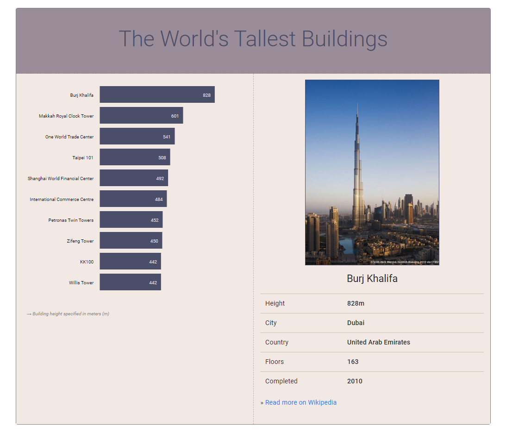
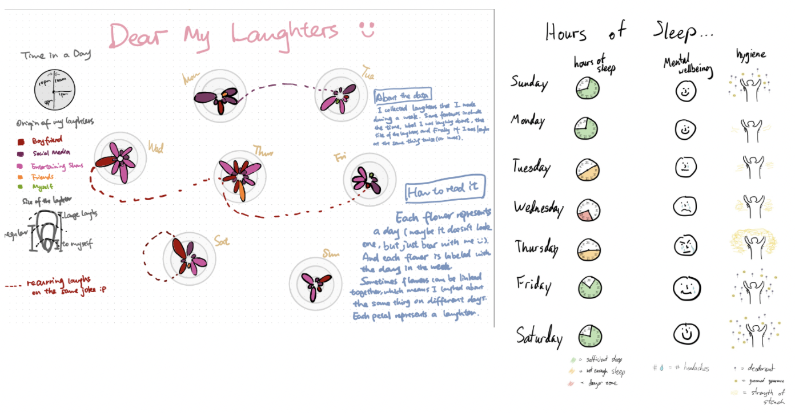
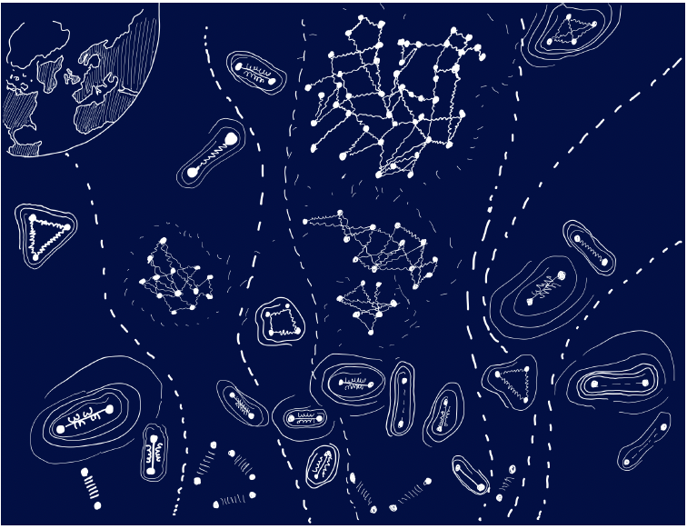
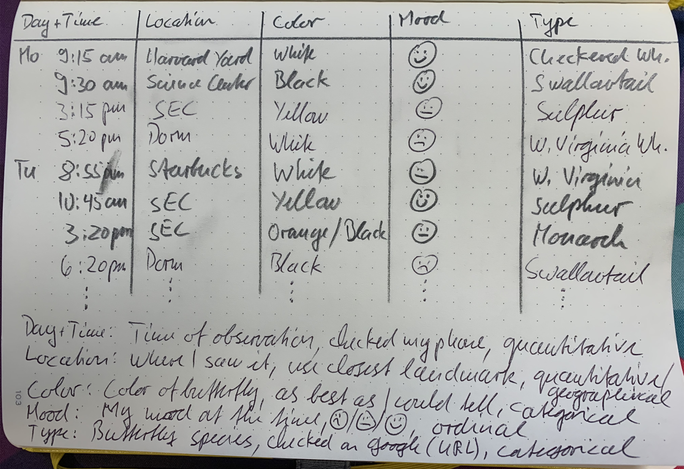

<!-----
layout: lab
exclude: true
----->


&nbsp;

# Week 04 | Homework

This homework assumes that you have read and programmed along with chapter 3 (p. 53-62) and chapter 5 in *D3 - Interactive Data Visualization for the Web*.

&nbsp;

## 1) The World's Tallest Buildings (7 points)

In this homework you will implement a horizontal bar chart with D3. Your bar chart will represent the ten tallest, fully-completed buildings in the world. Users will be able to click on a bar or label on the chart to get more information about a specific building.

*During development you can base your work on the following screenshot, but the design decisions (colors, fonts, ...) are principally up to you:*



### Data

We have provided a dataset with the world's tallest buildings. The CSV file (```buildings.csv```) includes a header row, which should help you to identify the different values, and a list of ten buildings.

The ```img``` folder contains an image in portrait format for each building.

### Implementation

1. **Download the resources**

	Please download the data (buildings.csv file) as well as the images. You'll find all files in the template ZIP for this week's hw on Canvas. This [link](https://www.cs171.org/Homework_instructions/week-04/hw/week-04_hw_template.zip) should get you there quickly.
	
2. **Set up a new D3 project and load the CSV file**
	
3. **Create a multi-column layout (HTML/CSS)**

	Split your page into multiple columns. The bar chart will be placed on the left side of the page while the right side will consist of a container that displays the dynamic content when the user selects a building in the bar chart. We strongly encourage you to use the *Bootstrap* [grid system](https://getbootstrap.com/docs/5.1/layout/grid/).
	
4. **Draw the SVG bar chart with D3**

	- Create a drawing area with at least 500 x 500px
	- Bind the loaded data to SVG rectangles (and place them correctly)
	- The bars should be left-aligned
	- Similar this week's lab, the different heights are given in pixels, so you don't have to use dynamic scales (data column: ```height_px```). That's something we'll cover in the next week.

5. **Add labels for** ***building names*** **and** ***height measures*** **to the bar chart**
	
	- The *building names* should be placed left of the bar chart and be right aligned (use the SVG text property ```text-anchor: end```). That means that you will have to shift your rectangles to the right, to avoid overlapping of text and rectangles. (Take a look at our example screenshot above to see how it should look.)
	- The labels for the *building heights* should be displayed inside the rectangles, at the right end of the bars.
	- Use proper font colors and sizes

	Note: If you are using the same HTML tags for different selections you have to work with *class attributes*. Here's an example:
	
	```javascript
	svg.selectAll("span.firstName")
		.data(data)
    	.enter()
    	.append("span")
    	.attr("class", "firstName")
		...
		
	svg.selectAll("span.age")
		.data(data)
    	.enter()
    	.append("span")
    	.attr("class", "age")
		...
	```
	
	We generally recommend that you use *class attributes*, and to add styling rules - which should affect the whole selection - to your external stylesheet.

6. **Sort the buildings in descending order by height**

	*Include your sorting algorithm directly after loading the data.*

7. **Make it interactive**

	*After selecting a specific building by clicking on the SVG labels or bars, 
	more detailed information should be presented to the user. That information
	should live in a separate column. Take a look at our solution to get some inspiration.*

	Just like in the lab, you will have to use D3 *event listeners* to solve this task. 
	However, in the homework, you're supposed to do more than just firing a console.log. 
	We recommend writing a separate function that you call to take care of the task.
	
8. **Use good programming practices to structure your code**

	This is a good point to take a couple of minutes to think about your code. Is everything clear, well structured, and documented? Oftentimes moving a block of code into its own separate function goes a long way toward improving readability! Your code should be concise and easy to read. That not only reduces debugging time, but will allow you to understand your code when you come back to it in a couple of months.  Be kind to your future self!
	
	* Identify code that can easily be re-factored into separate functions. E.g. click event listeners for the rectangles and text currently behave the same way. That means you should probably have a single function that is called when clicking either on a rectangle or a building name.
	* Document all your functions, and make note of important points in the code. However, don't go overboard by documenting every line of code.
	* Use speaking variable names. Avoid using names like ```var temp_d``` or ```.div3```. Rather use names like ```var sorted_buildings``` or ```.barchart```. 

9. **Use CSS to design your page**

	*Take care of an adequate spacing between your elements.*
	
	> We have used the *Google Font "Roboto"* in our example. If you are interested in using different fonts, this page might be helpful: [https://www.google.com/fonts](https://www.google.com/fonts)
	
<!--## 2) Design Critique (3 points)


*Source: ([http://ericagunn.com/2020/08/09/whitespace-in-dashboard-design/](http://ericagunn.com/2020/08/09/whitespace-in-dashboard-design/))*

#### Task:

Critique this dashboard using the design principles and terminology we discussed in class (C.R.A.P., Gestalt Principles, Tufte). 

&nbsp;
-->

## 2) Dear Data: Collecting Personal Data (3 points)

Over the next two weeks you will observe, collect, and sketch a visualization inspired by the Dear Data project. This week, you will collect personal data, and next week you will sketch a visualization that encodes this data using creative, artistic, and whimsical visual encodings inspired by the work of Georgia Lupi and Staphanie Posavec. The student with the best Dear Data visualization, as determined by our TFs, will **win a copy of the Dear Data book**!


<!---->


Here are some pictures of last year's submissions:




<!--
-->


In determining the winner, the TFs look for creativity (in the type of data you collect, as well in your visual sketch), solid data collection, and good design.

**Why collect personal data?**

There are several reasons for collecting personal data. Spending time with your data will help you better understand yourself. It helps you reflect on what makes you you. The data you collect and the choices you make reflect your personality. It is a way to figure out what is really important to you, since measuring something means that it matters. Finally, collecting personal data is another way to document your life, just as words in a journal and images you capture are documenting your human experience.

**What data to collect**

Think about what personal data you want to collect this week. Anything that can be measured is data, and any measurement that relates to you and your life is personal data. Examples include drinks, sounds, transportation, fitness, indecision, compliments, relationships, mirrors, emotions, workspaces, sports, apologies, things you buy, laughter, complaints, food, etc. In your homework document, write down several options, and then make a final decision. Tell us why you chose to collect this particular data.

**How much data to collect**

You must collect data for **at least 5 days** with **at least 3 observations** per day, so make sure to get started early. Each data item (i.e., rows in your data table) needs to have **at least 5 attributes** (i.e., columns in your data table), including the date and time when you collected each item. More attributes are better, especially if they are used to make connections between different data items (e.g., how people are connected, and who they are connected to).

*Example:* You decide to collect data about butterflies. Each row of your data table will be a butterfly sighting. The first attribute is the day and time of when you saw the butterfly. Other attributes (columns) in your table are where you saw it, its color, what mood you were in (using emojis), what kind of butterfly you think it was. You make sure to keep an eye out for butterflies to hopefully see at least three of them each day. If you don't, you can make a couple of sightings (but do not cheat too much). 

**How to collect your data**

To collect your data we strongly suggest to use pen and paper. You can easily carry them around with you all week long, they never need power, and they are easier and more fun to use. When you are done, transfer your data into a table if it is not already in table form. Put the data items into rows and the attributes into columns.

Make sure to label each column and to **provide additional explanations for your data attributes** below your table, including at least what they mean, how you collected them, and their data type (categorical, ordinal, or quantitative).

_Example: Below is a picture of an example data table for the butterfly data, including a legend that explains each attribute._




**How to submit your data**

If you collected your data on paper, take a picture of your table and submit it with your homework. If you like, you can also transfer your data to a spreadsheet and submit it that way. A spreadsheet allows you to easily compute aggregate statistics, e.g., averages, medians, or percentages, although you can also do that with pen and paper.

## 3) Finish up your Design Sprint tasks

* Create Create at least 10 sketches (per group member) that answer some or all of the questions you came up with during the ‘map’ phase. Upload them to your team's process book.
* Detailed instructions can be found in the [design sprint instructions](https://docs.google.com/document/d/1cPr0Thr63TwuH5fQevZ1XqMzT5d-emr70SFq7eF-qmI/edit).


## 4) Bonus Task (1 point)

Please make sure to finish all previous tasks before you start with the bonus activity. Extra credit is only given if the rest of the homework has been completed and the full possible points have been received. This task is intended for those of you who already have more experience with HTML, CSS and JS.

When the user clicks on a bar or on a text label you are currently displaying, additional information about the selected building in the right column should appear. Include a link below the table that leads to the building's Wikipedia page. The URLs should be generated automatically from your data and the page should open in a new browser tab.

&nbsp;


## 5) Submit Homework in Canvas

Submission instructions:

1. Use the following recommended folder structure:

```
/submission_week-04_FirstnameLastname
	lab_partner.txt	
    dear_data/      ...folder for your data that you collected for dear_data    
    implementation/ ...folder for your code
        lab/             
                index.html
                css/ 		...folder with all CSS files
                js/ 		...folder with all JavaScript files\
                ..
            hw/
                index.html
                css/ 		...folder with all CSS files
                js/ 		...folder with all JavaScript files\
                ..
    
```

2. Make sure to keep the overall size of your submission under 5MB! Sketches don't have to be in the highest resolution, but should still be readable.

3. Upload a single .zip file.

4. Also submit the completed lab on Canvas.

**Congratulations for finishing the Homework! See you in class!**
