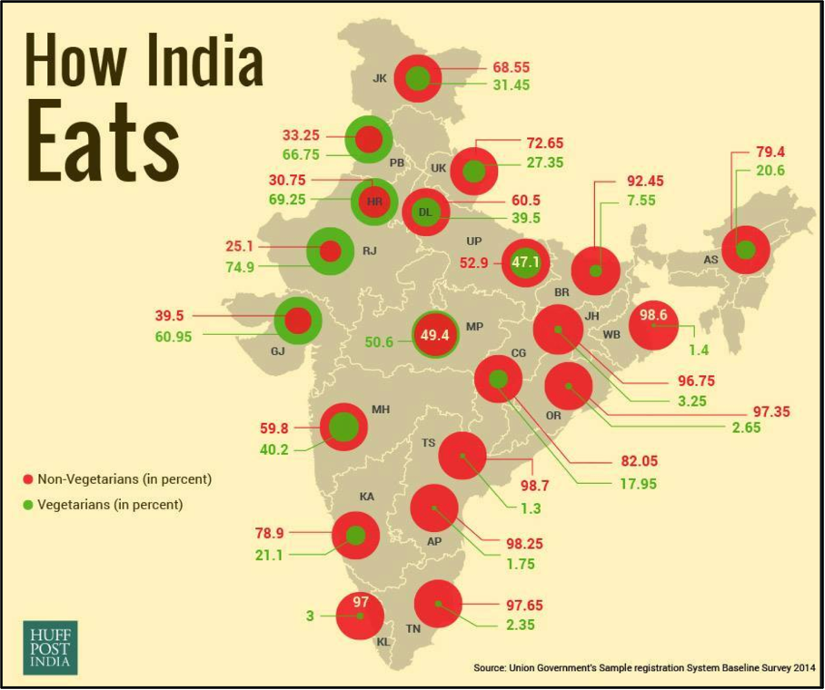
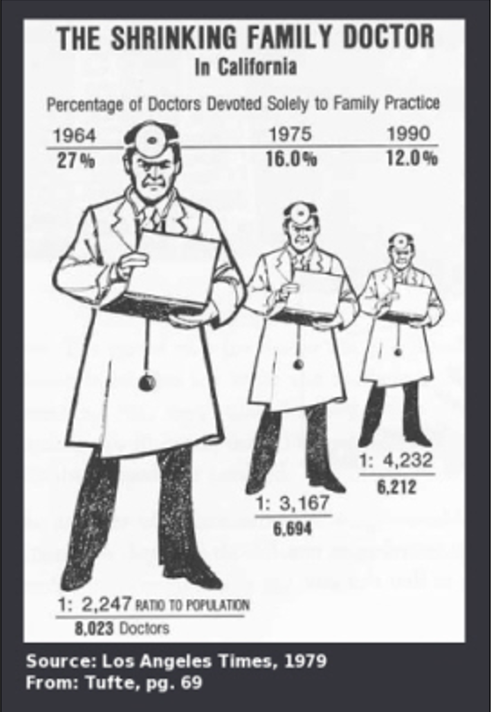
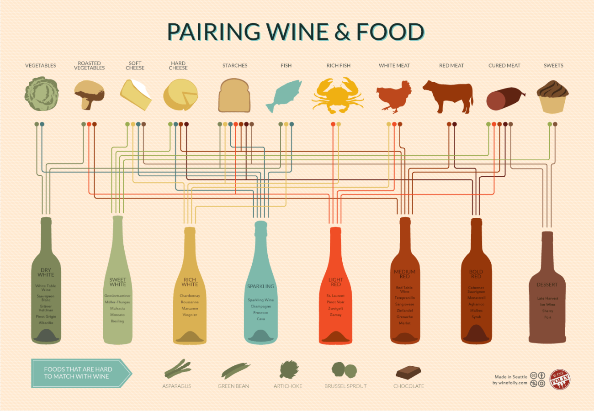
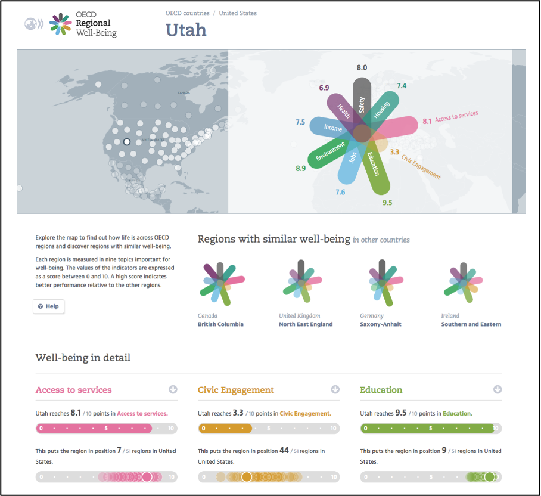

<!-----
layout: lab
exclude: true
----->

&nbsp;

# Homework 7

This homework draws on the visual design principles and guidelines we have covered in class so far. We encourage you to go back and look at the slides and videos of previous lectures before completing this homework.

## 1) Design Critique 

Source: http://viz.wtf/image/162284459410

### Task 1.1: Critique

Write a design critique of the visualization above (‘How India Eats’). Your critique should also address the following questions:

- **Who** is the audience?
- **What** is the objective of the design? What questions does the visualization answer or try to answer?
- **What** elements of the design are related to that objective?
- **Are** those elements effective in achieving the objective? Why or why not?
- **How** is the visualization a success or a failure? List 3 positive and 3 negative aspects.
- **Why** do you like/dislike this visualization?

> Maximum of 400 words

### Task 1.2: Re-design

Create a sketch of an alternative visualization of the same data above (‘How India Eats’) with an improved data-ink ratio and better graphical integrity. 

- Make sure you add a **caption** and **legend**. 
- Add a paragraph describing how you changed the **data-ink ratio** and **graphical integrity**.

## 2) Graphical Integrity, Gestalt Principles, C.R.A.P. Principles 

### Task 2.1: Graphical integrity

Evaluate the visualization below (‘The shrinking family doctor’), based on Tufte’s ideas of... 
- a) graphical integrity
- b) lie factor
- c) data-ink ratio 
- d) chart junk

In your response, push yourself to analyze how you might improve the **data-ink ratio**.

> Maximum of 300 words

### Task 2.2: Gestalt principles

Look at the visualization below (‘Pairing wine & food’) and complete the following tasks... 

- List at least **4 Gestalt principles** being used in the visualization.
- Describe each principle you listed in context.

> Maximum of 300 words

Source: https://laurenadhav.wordpress.com/2014/02/15/data-visualization-critique/

To learn more about Gestalt principles, please refer to material from our class on October 12th.

### Task 2.3: C.R.A.P. design principles

Look at the visualization below (‘OECD well-being’) and complete the following tasks:

- List all of the C.R.A.P. principles
- Discuss how they are applied in this website design 

> Maximum of 300 words

Source: http://www.oecdregionalwellbeing.org/

To learn more about C.R.A.P. design principles, please refer to material from our class on October 12th.

## 3) Visual Vocabulary, Visual Channels

### Task 3.1: Sugar content in foods over time

**Scenario:** Visualize the change in the amount of sugar contained in different food groups (cereal, bread, etc) from 1950 to today.

Look at the visual vocabulary (https://bit.ly/visvocab or https://bit.ly/miro-visual-vocabulary) and **pick the top two** visual encodings you would choose to visualize the data of the above scenario.

For each of your two visual encodings, describe (in max 300 words):
- **what** questions you would answer,
- **what** data you (assume) you have,
- **why** you would choose the visual encoding, and
- **how** you would encode the data (i.e., which marks and channels would you use to encode which attributes of the data).

Please also **include a sketch for each of your top two visual encodings** that show how you map the scenario’s data to the visualization.

## 4) Submit Homework in Canvas

Please submit your homework as a single pdf file (including your written text and sketches). 
- Clearly label all your responses and match them to the corresponding homework task (e.g., ‘Answer for task 2.2:....’).
- Make sure your sketches include appropriate titles, labels, axes, and legends.

**Congratulations for finishing this week's homework! See you in class!**
